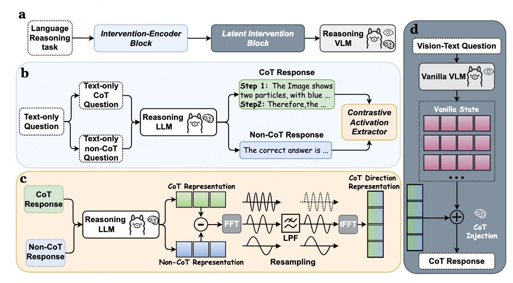

# L2V-CoT: Cross-Modal Transfer of Chain-of-Thought Reasoning via Latent Intervention (AAAI 2026 Oral)

Official implementation for the AAAI 2026 Oral paper [L2V-CoT: Cross-Modal Transfer of Chain-of-Thought Reasoning via Latent Intervention](https://arxiv.org/abs/2511.17910).

<div align="center">
  <br>
  <h6 style="text-align: center;">Figure 1: The overview of Latent Intervention for LLM-to-VLM CoT Transfertion (L2V-CoT).</h6>
</div>

## 🌟 Contributions 

1. To our best knowledge, we are the first to leverage Linear Artificial Tomography to analyze the transferability of reasoning capabilities between LLMs and VLMs.
2. We propose L2V-CoT, a novel training-free method that transfers the general CoT reasoning capability of LLMs to VLMs, thereby enhancing the reasoning ability of VLMs.
3. Extensive experiments validate the effectiveness of our approach in transferring CoT reasoning across modalities.


## 📍 Run

**We sincerely apologize that, due to the authors’ recent workload, the code has not yet been thoroughly cleaned up and organized, and the current version may still contain some issues. We will gradually improve and refine it in future updates. For researchers interested in extending this work, the general pipeline is as follows:**

1. **Use `get_representation.sh` or `get_representation_llm.sh` to extract CoT representations.**
2. **Then run the `evaluate_vlm_representation*.sh` scripts for VLM inference.**

## ❤️ Acknowledgements

This codebase is built upon and inspired by several excellent prior works and open-source projects. We sincerely thank the authors for making their papers and code publicly available.

In particular, we would like to acknowledge the following projects:
- [Unlocking General Long Chain-of-Thought Reasoning Capabilities of Large Language Models via Representation Engineering (ACL 2025)](https://arxiv.org/abs/2503.11314)
- [Bring Reason to Vision: Understanding Perception and Reasoning through Model Merging (ICLR 2026)](https://arxiv.org/abs/2505.05464)
- [VLMEvalKit](https://github.com/open-compass/VLMEvalKit)

Their contributions have greatly inspired and supported this work.

## ✏️ Citation

If you find this paper helpful, please consider citing it.

```
@article{zhan2025l2v,
  title={L2V-CoT: Cross-Modal Transfer of Chain-of-Thought Reasoning via Latent Intervention},
  author={Zhan, Yuliang and Tang, Xinyu and Wan, Han and Li, Jian and Wen, Ji-Rong and Sun, Hao},
  journal={arXiv preprint arXiv:2511.17910},
  year={2025}
}
```
